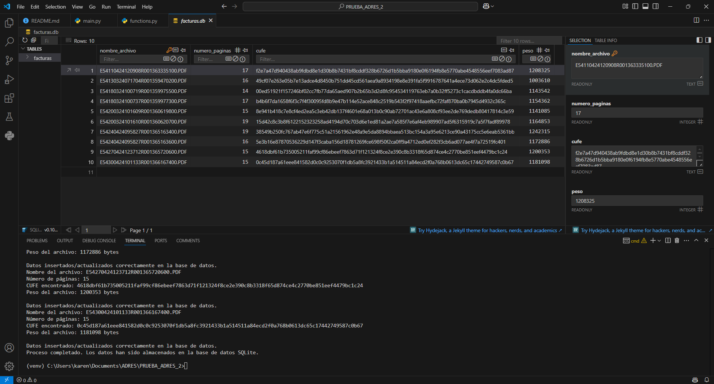

# Prueba técnica para desarrollador junior

Este proyecto consiste en un script en Python que extrae información de facturas en formato PDF y almacena los siguientes datos en una base de datos SQLite:

- Nombre del archivo
- Número de páginas
- CUFE _(identificado mediante la expresión regular `\b([0-9a-fA-F]\n*){95,100}\b`)_
- Peso del archivo

La extracción del CUFE se realiza recorriendo cada página del PDF hasta encontrar el primer patrón coincidente.

## Funcionalidades

- **Extracción de datos**: El script extrae el nombre del archivo, el número de páginas, el CUFE y el peso del archivo de cada PDF en la carpeta `pdf_sample`.
- **Almacenamiento en base de datos**: Los datos extraídos se almacenan en una base de datos SQLite llamada `facturas.db`.
- **Detección de duplicados**: Si los datos de un archivo ya existen en la base de datos, se pedirá confirmación para sobrescribirlos.
- **Interfaz de línea de comandos**: El script se ejecuta desde la línea de comandos y procesa automáticamente todos los archivos PDF en la carpeta `pdf_sample`.

## Requisitos de la prueba

- Python 3.12.9
- PyMuPDF (para leer los archivos PDF)

_Nota: SQLite viene incluido en la biblioteca estándar de Python, por lo que no es necesario instalar ningún paquete adicional para trabajar con SQLite._

## Instalación

Para instalar y ejecutar el proyecto en su máquina local:

### Clonar el Repositorio

Primero, clona el repositorio de Git a tu máquina local utilizando el siguiente comando:

```bash
git clone https://github.com/Karen-Lara98/prueba_adres_2.git
```

Navega al directorio del proyecto:

```bash
cd prueba_adres_2
```

### Crear y Activar un Entorno Virtual (Opcional)

Es recomendable utilizar un entorno virtual para mantener las dependencias del proyecto separadas y organizadas.

Para crear y activar un entorno virtual, ejecuta:

En Windows:

```bash
python -m venv venv
venv\Scripts\activate
```

En Unix o MacOS:

```bash
python3 -m venv venv
source venv/bin/activate
```

### Instalar Dependencias

Instala todas las dependencias requeridas para el proyecto ejecutando:

```bash
pip install -r requirements.txt
```

## Estructura del Proyecto

```bash
prueba_adres_2/
├── main.py           # Script principal
├── functions.py      # Script de funciones para script principal
├── static/           # Carpeta con las capturas de funcionalidad
├── pdf_sample/       # Carpeta con los archivos PDF a procesar
├── facturas.db       # Base de datos SQLite (se creará automáticamente)
├── .gitignore        # Archivo de git 
└── requirements.txt  # Archivo con las dependencias del proyecto
```

## Uso

Coloca tus archivos PDF en la carpeta pdf_sample.

Ejecuta el script:

```bash
python main.py
```

El script procesará cada PDF en la carpeta, extraerá el nombre del archivo, el número de páginas, el CUFE (si se encuentra) y el peso del archivo, y almacenará estos datos en la base de datos facturas.db.

Si se encuentra que los datos de un archivo ya existen en la base de datos, se pedirá confirmación para sobrescribirlos.

### Ejemplos de funcionalidad

- Base de datos



En este caso usé una extensión que se llama SQLite Viewer https://marketplace.visualstudio.com/items?itemName=qwtel.sqlite-viewer para poder visualizar el cómo mi base de datos se veía afectada después de correr el script.